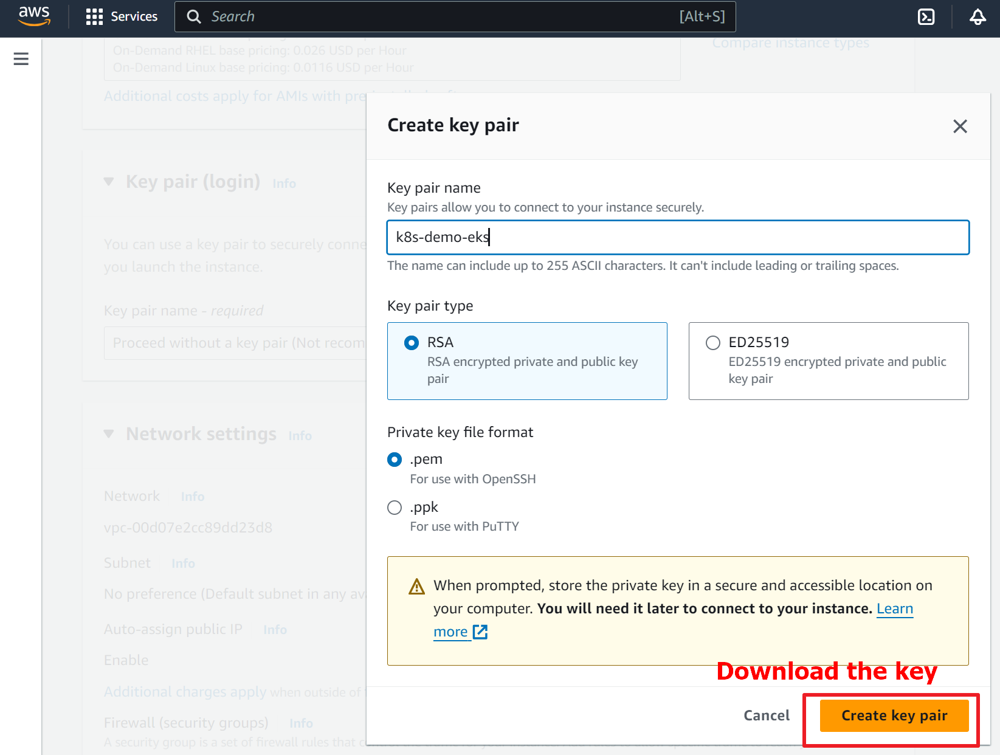
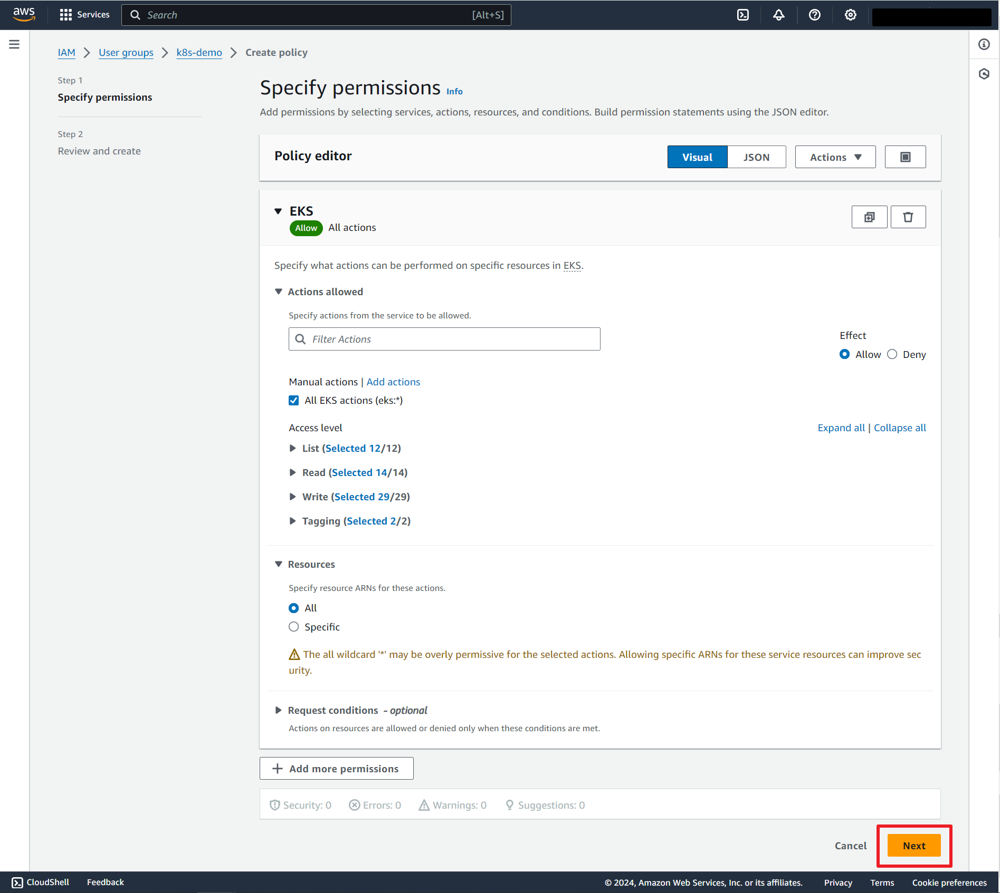

# AWS eksctl
## Create an EC2 instance to demonstrate how to use `eksctl`





<br>

## Connect to the EC2 instance with the key (pem file) that was created
```shell
# Make sure the key file is in the same directory of the terminal
$ ls
k8s-demo-eks.pem

# Use ssh to connect to the EC2 instance
$ ssh -i k8s-demo-eks.pem ec2-user@<ec2-public-ip>
```

<br>

## Install `eksctl`
- After connecting to the ec2 instance, install `eksctl` to control EKS clusters.
```shell
curl --silent --location "https://github.com/weaveworks/eksctl/releases/latest/download/eksctl_$(uname -s)_amd64.tar.gz" | tar xz -C /tmp

sudo mv /tmp/eksctl /usr/local/bin
```

<br>

## Set up IAM to give users the permission to use `eksctl`
### What is IAM?
IAM (Identity and Access Management) is an AWS web service that  securely controls access to AWS resources by **creating groups or users and giving them the permissions you want**.
### Create a group and assign permissions





<br>

## Install kubectl on the EC2 instance


```shell
# Run these commands to install kubectl
export RELEASE=<enter default eks version number here. Eg 1.17.0>
curl -LO https://storage.googleapis.com/kubernetes-release/release/v$RELEASE/bin/linux/amd64/kubectl
chmod +x ./kubectl
sudo mv ./kubectl /usr/local/bin/kubectl
```

